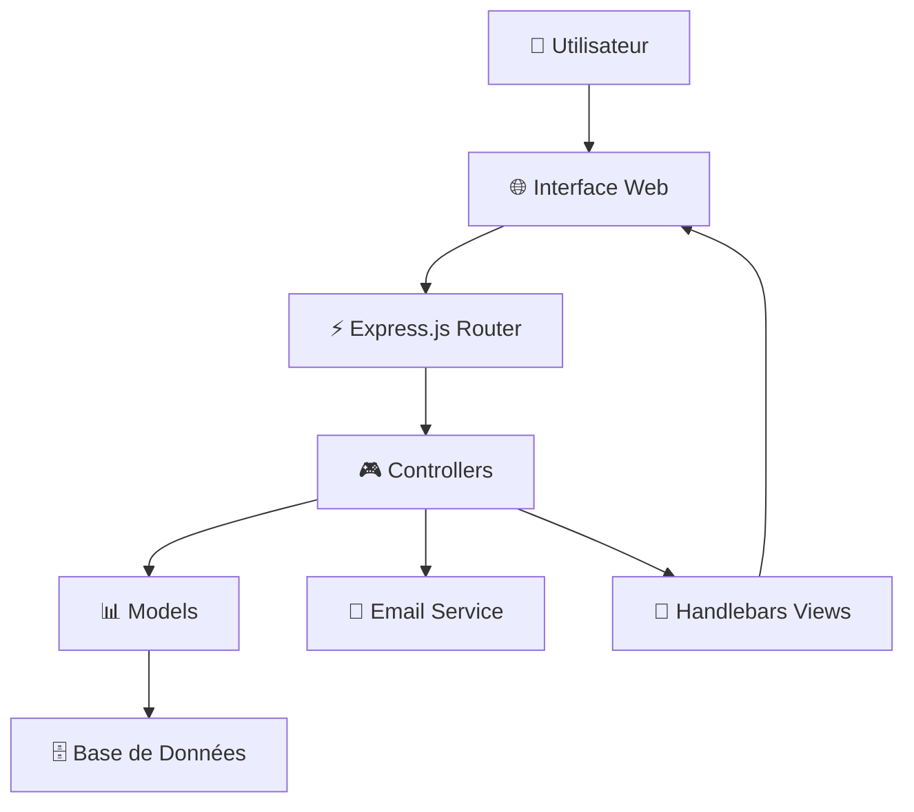

<div align="center">

# 🌊 SealVo - Web Vocab v0 📚

*L'apprentissage de vocabulaire réinventé avec l'intelligence artificielle*


[](https://nodejs.org/)
[](https://expressjs.com/)
[](LICENSE)

[](https://github.com/votre-username/SealVo)
[](https://github.com/votre-username/SealVo)
[](https://github.com/votre-username/SealVo/issues)

---

**🎯 Une application web moderne pour l'apprentissage et la gestion de vocabulaire avec système de révision espacée et suivi de progression intelligent.**

[🚀 Démo Live](#) • [📖 Documentation](#) • [🐛 Signaler un Bug](https://github.com/votre-username/SealVo/issues) • [💡 Demander une Fonctionnalité](https://github.com/votre-username/SealVo/issues)

</div>

## 📋 Table des Matières

<details>
<summary>🔍 Cliquez pour développer</summary>

- [🌟 Aperçu](#-aperçu)
- [🚀 Fonctionnalités](#-fonctionnalités)
- [🎬 Démo & Captures](#-démo--captures)
- [⚡ Démarrage Rapide](#-démarrage-rapide)
- [🛠️ Technologies](#️-technologies)
- [📁 Architecture](#-architecture)
- [🎮 Guide d'Utilisation](#-guide-dutilisation)
- [🔧 Configuration Avancée](#-configuration-avancée)
- [🚀 Déploiement](#-déploiement)
- [🤝 Contribution](#-contribution)
- [📞 Support](#-support)

</details>

---

## 🌟 Aperçu

> **SealVo** transforme l'apprentissage de vocabulaire en une expérience gamifiée et personnalisée. Grâce à l'intelligence artificielle et aux techniques de révision espacée, chaque utilisateur bénéficie d'un parcours d'apprentissage adapté à son rythme.

### 🎯 Pourquoi SealVo ?

<table>
<tr>
<td align="center" width="33%">

<br><strong>IA Intégrée</strong>
<br>Algorithmes adaptatifs pour une mémorisation optimale
</td>
<td align="center" width="33%">

<br><strong>Suivi Avancé</strong>
<br>Statistiques détaillées et progression en temps réel
</td>
<td align="center" width="33%">

<br><strong>Multi-Device</strong>
<br>Expérience fluide sur tous les appareils
</td>
</tr>
</table>

## 🚀 Fonctionnalités

### 📝 Gestion du Vocabulaire
<details>
<summary>🔽 Fonctionnalités détaillées</summary>

- **✨ Ajout intelligent** : Interface intuitive avec suggestions automatiques
- **📊 Import en masse** : Support des fichiers Excel (.xlsx, .xls) avec validation
- **🔍 Validation avancée** : Vérification de taille (5MB max) et type de fichier
- **📱 Interface responsive** : Optimisée pour mobile et desktop
- **🎨 Éditeur riche** : Formatage de texte et support des médias
- **🔖 Catégories** : Organisation par thèmes et difficultés

</details>

### 🎯 Système d'Apprentissage
<details>
<summary>🔽 Algorithmes d'apprentissage</summary>

- **🧠 Révision espacée** : Algorithme adaptatif pour optimiser la mémorisation
- **📈 Suivi de progression** : Barre de progression basée sur les streaks d'apprentissage
- **📊 Dashboard interactif** : Visualisation des statistiques et performances
- **🔥 Animation de streak** : Affichage visuel du nombre de jours consécutifs
- **🎯 Difficultés adaptatives** : Ajustement automatique selon les performances
- **🏆 Système de récompenses** : Badges et accomplissements

</details>

### 📧 Notifications & Rappels
<details>
<summary>🔽 Système de notifications</summary>

- **⏰ Emails automatiques** : Rappels quotidiens personnalisés pour réviser
- **🔐 Reset de mot de passe** : Système sécurisé de réinitialisation
- **🔔 Notifications en temps réel** : Alertes personnalisées dans l'interface
- **📱 Notifications push** : Rappels sur mobile et desktop
- **🎛️ Paramètres flexibles** : Personnalisation des fréquences et types

</details>

### 🎨 Interface Utilisateur
<details>
<summary>🔽 Expérience utilisateur</summary>

- **🎨 Design moderne** : Interface épurée et intuitive
- **✨ Animations fluides** : Transitions et effets visuels
- **⌨️ Raccourcis clavier** : Navigation rapide (Ctrl+Enter, Escape)
- **🌓 Thème adaptatif** : Mode sombre/clair automatique
- **🎯 Accessibilité** : Conforme aux standards WCAG 2.1
- **🌐 Multi-langue** : Support international

</details>

## 🎬 Démo & Captures

### 🖥️ Interface Principale
```
🎯 Dashboard Interactif
┌─────────────────────────────────────────────────────┐
│ 🔥 Streak: 7 jours    📊 Progression: 23%    🏆 Niv 3 │
│ ━━━━━━━━━━━━━━━━━━━━━━━━━━━━━━━━━━━━━━━━━━━━━━━━━━━━━━━ │
│                                                     │
│ 📚 Mots à réviser aujourd'hui: 12                  │
│ ⏰ Prochaine révision: dans 2h 30m                 │
│                                                     │
│ [🎯 Commencer la révision]  [📝 Ajouter des mots]  │
└─────────────────────────────────────────────────────┘
```

### 📱 Version Mobile
```
📱 SealVo Mobile
┌─────────────────┐
│ 🔥 7j  📊 23%   │
│ ━━━━━━━━━━━━━━━━━ │
│                 │
│ 📚 12 mots      │
│ ⏰ 2h 30m       │
│                 │
│ [🎯 Réviser]    │
│ [📝 Ajouter]    │
└─────────────────┘
```

### 🎮 Fonctionnalités Interactives
- **⚡ Animations fluides** : Transitions de 300ms avec easing
- **🎨 Feedback visuel** : Couleurs adaptatives selon les performances
- **🔄 Synchronisation** : Mise à jour en temps réel
- **📊 Graphiques** : Visualisation des données d'apprentissage

---

## ⚡ Démarrage Rapide

### 🚀 Installation en 1 minute

```bash
# 1️⃣ Cloner le projet
git clone https://github.com/votre-username/SealVo.git
cd SealVo

# 2️⃣ Installer les dépendances
npm install

# 3️⃣ Configurer l'environnement
cp .env.example .env
# Éditer .env avec vos paramètres

# 4️⃣ Lancer l'application
npm run dev
```

### 🎯 Première Utilisation

1. **🔧 Configuration Gmail** : Suivez [ce guide](#-configuration-gmail)
2. **📊 Créer un compte** : Accédez à `http://localhost:3000`
3. **📝 Ajouter vos premiers mots** : Utilisez l'import Excel pour commencer
4. **🎮 Commencer à apprendre** : Lancez votre première session de révision

## 🛠️ Technologies

### 🔮 Stack Technique Moderne

<div align="center">

| **Backend** | **Frontend** | **Base de Données** | **DevOps** |
|-------------|--------------|-------------------|-----------|
|  |  |  |  |
|  |  |  |  |
|  |  |  |  |

</div>

### 🔧 Détails Techniques

#### Backend & API
- **Node.js v16+** : Serveur JavaScript haute performance
- **Express.js** : Framework web minimaliste et flexible
- **Handlebars** : Moteur de templates logicless
- **bcryptjs** : Hachage sécurisé des mots de passe
- **nodemailer** : Envoi d'emails avec templates HTML

#### Frontend & UX
- **HTML5/CSS3** : Structure sémantique et styles modernes
- **JavaScript ES6+** : Interactions dynamiques et asynchrones
- **AJAX/Fetch API** : Communication client-serveur
- **Responsive Design** : Adaptation multi-devices avec breakpoints CSS

#### Architecture & Sécurité
- **Modèles MVC** : Séparation des responsabilités
- **Sessions sécurisées** : Gestion d'authentification
- **Validation côté serveur** : Sécurité des données
- **Protection CSRF** : Prévention des attaques cross-site

## 📋 Prérequis

### 🔧 Environnement de Développement
```bash
# Vérifier les versions installées
node --version    # v16.0.0+
npm --version     # v7.0.0+
git --version     # v2.30.0+
```

<table>
<tr>
<th>Composant</th>
<th>Version Minimum</th>
<th>Version Recommandée</th>
<th>Installation</th>
</tr>
<tr>
<td>🟢 Node.js</td>
<td>v16.0.0</td>
<td>v18.x LTS</td>
<td><a href="https://nodejs.org/">nodejs.org</a></td>
</tr>
<tr>
<td>📦 npm</td>
<td>v7.0.0</td>
<td>v9.x</td>
<td>Inclus avec Node.js</td>
</tr>
<tr>
<td>📧 Gmail</td>
<td>Compte actif</td>
<td>Avec 2FA activé</td>
<td><a href="https://gmail.com/">gmail.com</a></td>
</tr>
</table>

### 🛠️ Configuration Gmail
<details>
<summary>📧 Guide étape par étape</summary>

1. **🔐 Activer l'authentification à 2 facteurs**
   - Accédez à [myaccount.google.com](https://myaccount.google.com)
   - Sécurité → Authentification à 2 facteurs

2. **🔑 Générer un mot de passe d'application**
   ```bash
   # Étapes dans Gmail
   Paramètres → Sécurité → Mots de passe d'application
   → Sélectionner "Autre" → Nommer "SealVo"
   → Copier le mot de passe généré
   ```

3. **⚙️ Configurer les variables d'environnement**
   ```env
   USER_GMAIL=votre-email@gmail.com
   USER_PASS=mot-de-passe-app-genere
   ```

</details>

---

## 📁 Architecture

### 🏗️ Structure du Projet

```
🌊 SealVo/
├── 📁 src/
│   ├── 📁 app/
│   │   ├── 📁 controllers/          # 🎮 Logique métier
│   │   │   ├── 📁 apiControllers/   # 🔄 API REST
│   │   │   ├── 📄 SiteController.js
│   │   │   └── 📄 ResetPasswordController.js
│   │   ├── 📁 models/               # 📊 Modèles de données
│   │   │   ├── 📄 User.js
│   │   │   ├── 📄 Word.js
│   │   │   └── 📄 Learning.js
│   │   ├── 📁 middlewares/          # 🛡️ Sécurité & validation
│   │   └── 📁 config/               # ⚙️ Configuration
│   ├── 📁 public/                   # 🎨 Assets statiques
│   │   ├── 📁 css/
│   │   │   ├── 📄 dashboard.css
│   │   │   ├── 📄 addWord.css
│   │   │   └── 📄 responsive.css
│   │   ├── 📁 js/
│   │   │   ├── 📄 dashboard.js
│   │   │   ├── 📄 addWord.js
│   │   │   └── 📄 common.js
│   │   └── 📁 assets/               # 🖼️ Images, icônes
│   └── 📁 views/                    # 🎭 Templates
│       ├── 📁 layouts/
│       │   └── 📄 main.hbs
│       ├── 📁 partials/
│       └── 📄 dashboard.hbs
├── 📄 .env                          # 🔐 Variables d'environnement
├── 📄 package.json                  # 📦 Dépendances
├── 📄 server.js                     # 🚀 Point d'entrée
└── 📄 README.md                     # 📚 Documentation
```

### 🔄 Flux de Données



### 🔧 Patterns Architecturaux

- **🎯 MVC Pattern** : Séparation claire des responsabilités
- **🔌 Middleware Chain** : Traitement des requêtes en pipeline
- **📡 RESTful API** : Endpoints standardisés
- **🎭 Template Engine** : Génération dynamique de HTML
- **🔐 Session Management** : Gestion d'état côté serveur

## 🔧 Configuration Avancée

### 🌐 Variables d'Environnement

<details>
<summary>📄 Configuration complète du fichier .env</summary>

```env
# 🔐 Configuration Email Gmail
USER_GMAIL=votre-email@gmail.com
USER_PASS=mot-de-passe-app-genere

# 🗄️ Configuration Base de Données
DB_HOST=localhost
DB_PORT=3306
DB_NAME=web_vocab
DB_USER=root
DB_PASSWORD=votre-mdp-db

# 🚀 Configuration Serveur
PORT=3000
NODE_ENV=development
HOST=localhost

# 🔑 Sécurité
SESSION_SECRET=votre-cle-secrete-aleatoire-longue
JWT_SECRET=votre-jwt-secret
BCRYPT_ROUNDS=12

# 📧 Configuration Email Avancée
SMTP_HOST=smtp.gmail.com
SMTP_PORT=587
SMTP_SECURE=false
EMAIL_FROM="SealVo" <noreply@sealvo.com>

# 🎛️ Configuration Application
MAX_FILE_SIZE=5242880  # 5MB en bytes
UPLOAD_PATH=./uploads
LOG_LEVEL=debug
```

</details>

### 🔄 Scripts NPM

```json
{
  "scripts": {
    "start": "node server.js",
    "dev": "nodemon server.js",
    "test": "jest --coverage",
    "lint": "eslint src/",
    "lint:fix": "eslint src/ --fix",
    "build": "webpack --mode production",
    "deploy": "pm2 restart ecosystem.config.js"
  }
}
```

## 🎮 Guide d'Utilisation

### 🚀 Première Connexion

<details>
<summary>📝 Étapes d'installation et premier lancement</summary>

1. **🔧 Installation**
   ```bash
   # Cloner et installer
   git clone https://github.com/votre-username/SealVo.git
   cd SealVo
   npm install
   
   # Configurer l'environnement
   cp .env.example .env
   # Éditer .env avec vos paramètres
   
   # Lancer l'application
   npm run dev
   ```

2. **🌐 Accès à l'application**
   - Ouvrir `http://localhost:3000`
   - Créer un compte utilisateur
   - Activer les notifications email

3. **📚 Premiers mots**
   - Ajouter 5-10 mots manuellement
   - Ou importer un fichier Excel
   - Commencer votre première session

</details>

### 📝 Gestion des Mots

#### ✏️ Ajout Manuel
```bash
# Interface d'ajout de mots
┌─────────────────────────────────────────────────────┐
│ 📝 Ajouter un Nouveau Mot                          │
│                                                     │
│ Mot/Expression: [_________________]                 │
│ Définition:     [_________________]                 │
│ Catégorie:      [Général ▼]                        │
│ Difficulté:     [● Facile ○ Moyen ○ Difficile]    │
│                                                     │
│ [💾 Enregistrer] [🔄 Suivant] [📋 Importer]        │
└─────────────────────────────────────────────────────┘
```

#### 📊 Import en Masse
<details>
<summary>📥 Formats supportés et structure</summary>

**📄 Format Excel (.xlsx, .xls)**
| Colonne A | Colonne B | Colonne C (optionnel) |
|-----------|-----------|----------------------|
| Mot/Expression | Définition | Catégorie |
| Hello | Bonjour | Salutations |
| Computer | Ordinateur | Technologie |

**📄 Format CSV**
```csv
mot,definition,categorie
Hello,Bonjour,Salutations
Computer,Ordinateur,Technologie
```

**🔧 Validation automatique**
- ✅ Taille max: 5MB
- ✅ Formats: .xlsx, .xls, .csv
- ✅ Encodage: UTF-8
- ✅ Détection de doublons

</details>

### 🎯 Système d'Apprentissage

#### 🧠 Révision Espacée
```bash
# Algorithme adaptatif
Nouveau mot     → Révision après 1 jour
Réussi 1x       → Révision après 3 jours  
Réussi 2x       → Révision après 7 jours
Réussi 3x       → Révision après 15 jours
Réussi 4x       → Révision après 30 jours
```

#### 🔥 Système de Streak
- **🎯 Objectif quotidien** : Maintenir l'apprentissage
- **📊 Progression** : Barre de 30 jours maximum
- **🏆 Récompenses** : Badges et accomplissements
- **⚡ Motivation** : Animation visuelle du feu

### 📱 Raccourcis Clavier

| Raccourci | Action | Contexte |
|-----------|--------|----------|
| `Ctrl + Enter` | Valider le formulaire | Ajout de mots |
| `Escape` | Fermer les modales | Partout |
| `Tab` | Navigation rapide | Formulaires |
| `Ctrl + N` | Nouveau mot | Dashboard |
| `Ctrl + I` | Importer fichier | Page d'ajout |

---

## 🚀 Déploiement

### 🐳 Docker
<details>
<summary>📦 Configuration Docker</summary>

```dockerfile
# Dockerfile
FROM node:18-alpine
WORKDIR /app
COPY package*.json ./
RUN npm ci --only=production
COPY . .
EXPOSE 3000
CMD ["npm", "start"]
```

```yaml
# docker-compose.yml
version: '3.8'
services:
  sealvo:
    build: .
    ports:
      - "3000:3000"
    environment:
      - NODE_ENV=production
    env_file:
      - .env
```

</details>

### ☁️ Hébergement Cloud
<details>
<summary>🌐 Options de déploiement</summary>

**🔷 Heroku**
```bash
# Déploiement Heroku
heroku create sealvo-app
git push heroku main
heroku config:set NODE_ENV=production
```

**🔷 Vercel**
```bash
# Déploiement Vercel
npm i -g vercel
vercel --prod
```

**🔷 DigitalOcean**
```bash
# Configuration PM2
pm2 start ecosystem.config.js
pm2 save
pm2 startup
```

</details>

---

## 🐛 Dépannage & FAQ

### ❌ Erreurs Communes

<details>
<summary>🔧 Solutions aux problèmes fréquents</summary>

#### 📧 Erreur Email "Missing credentials"
```bash
# Vérifier la configuration .env
USER_GMAIL=votre-email@gmail.com
USER_PASS=mot-de-passe-application-gmail  # Pas votre mot de passe normal !

# Tester la connexion
npm run test:email
```

#### 📁 Problème d'import de fichier
```bash
# Vérifications
✅ Fichier < 5MB
✅ Format: .xlsx, .xls, .csv
✅ Structure: 2 colonnes minimum
✅ Encodage UTF-8

# Logs de débogage
npm run dev  # Mode développement avec logs détaillés
```

#### 🔥 Erreur de streak
```bash
# Vérifier les données utilisateur
# Dans le dashboard développeur (F12)
console.log(user.streak)  # Doit être un nombre
console.log(user.lastActivity)  # Doit être une date valide
```

</details>

### 🆘 Support Technique

<div align="center">

| 📞 **Support** | 📧 **Email** | 💬 **Discord** | 🐛 **Issues** |
|---------------|-------------|----------------|---------------|
| [Documentation](https://docs.sealvo.com) | support@sealvo.com | [Rejoindre](https://discord.gg/sealvo) | [GitHub Issues](https://github.com/votre-username/SealVo/issues) |

</div>


---

## 🤝 Contribution

### 👥 Contributeurs

<div align="center">

<a href="https://github.com/votre-username/SealVo/graphs/contributors">
  
</a>

**Merci à tous nos contributeurs ! 🙏**

</div>

### 🛠️ Comment Contribuer

<details>
<summary>📝 Guide de contribution</summary>

#### 🔧 Setup Développement
```bash
# 1. Fork le repo
git clone https://github.com/votre-username/SealVo.git
cd SealVo

# 2. Créer une branche
git checkout -b feature/nouvelle-fonctionnalite

# 3. Installer les dépendances
npm install

# 4. Lancer les tests
npm test

# 5. Lancer en mode développement
npm run dev
```

#### 📋 Types de Contributions
- **🐛 Bug fixes** : Correction d'erreurs
- **✨ Nouvelles fonctionnalités** : Ajout de features
- **📚 Documentation** : Amélioration du README ou docs
- **🎨 UI/UX** : Améliorations visuelles
- **⚡ Performance** : Optimisations
- **🔧 Refactoring** : Amélioration du code

#### 🎯 Workflow
1. **Issue First** : Créer/discuter d'une issue avant le code
2. **Small PRs** : Préférer les petites pull requests
3. **Tests** : Ajouter des tests pour les nouvelles fonctionnalités
4. **Documentation** : Mettre à jour la documentation si nécessaire
5. **Code Review** : Être patient et réceptif aux reviews

</details>

### 🎖️ Reconnaissance

<table>
<tr>
<td align="center">

<br><strong>Plus de 10 PR acceptées</strong>
</td>
<td align="center">

<br><strong>Plus de 5 bugs reportés</strong>
</td>
<td align="center">

<br><strong>Amélioration de la doc</strong>
</td>
</tr>
</table>

---

## 📊 Statistiques du Projet

<div align="center">

[](https://github.com/votre-username/SealVo/issues)
[](https://github.com/votre-username/SealVo/pulls)
[](https://github.com/votre-username/SealVo/commits)
[](https://github.com/votre-username/SealVo/releases)

[](https://github.com/votre-username/SealVo/stargazers)
[](https://github.com/votre-username/SealVo/network/members)
[](https://github.com/votre-username/SealVo)
[](LICENSE)

</div>

---

## 📄 Licence

Ce projet est sous licence **MIT** - voir le fichier [LICENSE](LICENSE) pour plus de détails.

```
MIT License

Copyright (c) 2024 SealVo Team

Permission is hereby granted, free of charge, to any person obtaining a copy
of this software and associated documentation files (the "Software"), to deal
in the Software without restriction, including without limitation the rights
to use, copy, modify, merge, publish, distribute, sublicense, and/or sell
copies of the Software, and to permit persons to whom the Software is
furnished to do so, subject to the following conditions:

The above copyright notice and this permission notice shall be included in all
copies or substantial portions of the Software.
```

---

<div align="center">

## 🌊 SealVo - Révolutionner l'Apprentissage

**Transformez votre manière d'apprendre le vocabulaire avec l'IA et la science cognitive**

### 🚀 Liens Utiles

[🌐 Site Web](https://sealvo.com) • [📚 Documentation](https://docs.sealvo.com) • [💬 Discord](https://discord.gg/sealvo) • [🐦 Twitter](https://twitter.com/sealvo_app)

### 💝 Soutenir le Projet

[](https://github.com/sponsors/votre-username)
[](https://buymeacoffee.com/sealvo)
[](https://paypal.me/sealvo)

---

**⭐ Si SealVo vous aide dans votre apprentissage, n'hésitez pas à nous donner une étoile sur GitHub !**

*Fait avec ❤️ par l'équipe SealVo*

[](https://github.com/votre-username/SealVo)
[](https://nodejs.org/)
[](https://github.com/votre-username/SealVo)

</div> 
